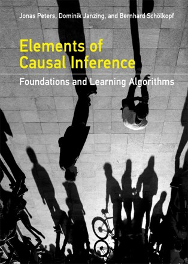

# Applied Causal Inference Course

This course is an overview of applied causal inference. The course starts with an introduction to causal inference. Then, we talk about moving from observation to intervention. We learn about directed acyclic graphs and non-parametric structural equation models to create causal models. Furthermore, we use various realistic examples to understand better the concepts we introduced in each chapter. By the end of this course, students will be able to develop familiarity with causal models for investigating a wide range of questions about the world works. 

This is an under development course, so keep tracking our course and let us know your feedback.

Thanks

[Reza Arghandeh](https://www.hvl.no/en/employee/?user=Reza.Arghandeh), [Michele Gazzea](https://www.hvl.no/en/employee/?user=Michele.Gazzea&user=Michele.Gazzea) & [Amir Miraki](https://www.hvl.no/en/employee/?user=Amir.Miraki)

### Goals:
- Information-era literacy: learning to be informed citizens, consumers, and hopefully producers of information.
- Understand sources of bias in data (a big challenge in data science). 
- Understand the importance of the causal discovery. 
- Understand the basics of causal models. 

### Learning Objectives:
1. Translate scientific questions and background knowledge into a causal model. 
2. Understand properties of causal models. 
3. Begin to develop familiarity with the uses of causal models for investigating a wide range of questions about the real world. 

# Lectures

|   | **Chapter**                    | **Discussion**            | 
|---|---------------------------------------------|---------------------------|
|   | 1-[Introduction to Causality](./lectures/CH-1-Introduction-to-Causality.ipynb)  |       | 
|   | 2-[Observation to Intervention](./lectures/CH-2-Observation-to-Intervention.ipynb)   |  [Discussion](./lectures/CH-2-Discussion-Observation-to-Intervention.ipynb)       | 
|   | 3-[Graphical Causal Models](./lectures/CH-3-Graphical-Causal-Models.ipynb) |  [Discussion](./lectures/CH-3-Discussion-Graphical-Causal-Models.ipynb)  |
|   | 4-[Structured Causal Models](./lectures/CH-4-SCM.ipynb) |    |
|   | 5-[Structure learning](./lectures/CH-5-Causal-structure-learning.ipynb) |   [Discussion](./lectures/CH-5-Discussion-Causal-structure-learning.ipynb)  |
|   | 6-[A real-world example: Hotel Booking Cancellations](./lectures/CH-6-Hotel.ipynb)
|   | 7-[Time series]()

## Course Offering

|   | **Course official name**                    | **University**            | **Country** | **Semester** | **Year** |
|---|---------------------------------------------|---------------------------|-------------|--------------|----------|
|   | IE-AUT 6: Introduction to Causal Inference  | University of Padova      | Italy       | Summer       | 2022     |
|   | PCS956: Trends in Applied Machine Learning  | Western Norway University | Norway      | Fall         | 2022     |
|   | IE-AUT 6: Applied Causal Inference         | University of Padova      | Italy       | Summer       | 2023     |
|   |                                             |                           |             |              |          |

## Suggested Python Libraries 

- [DoWhy](https://py-why.github.io/dowhy/index.html). A Python library that provides several tools for causal inference, modeling causal assumptions and validating them.

- [pgmpy](https://pgmpy.org/). Pure python implementation for Bayesian Networks. Implementations of various alogrithms for Structure Learning, Parameter Estimation, Approximate (Sampling Based) and Exact inference, and Causal Inference are available.

- [bnlearn](https://erdogant.github.io/bnlearn/pages/html/index.html). Library for learning the graphical structure of Bayesian networks in Python. Build on top of the pgmpy library but a bit easier to use.

## Suggested Books

Not Free, 2018, Causal Inference Concept:
[link](http://bayes.cs.ucla.edu/WHY/)

Free, 2019 ML for Causal Inference:
[link](https://mitpress.mit.edu/books/elements-causal-inference)

Free, 2020 Causal Inference Theory:
[link](https://www.hsph.harvard.edu/miguel-hernan/causal-inference-book/)

 

## Suggested Blogs

*Bringing More Causality to Analytics*, by Motif Analytics Inc., 2022 [Link](https://motifanalytics.medium.com/bringing-more-causality-to-analytics-d378108bb15)

*Causality for Machine Learning* by Cloudera Inc., 2020 [Link](https://ff13.fastforwardlabs.com/#why-are-we-interested-in-causal-inference%3F)

*From How to Why* by Ericsson, 2020 [Link](https://www.ericsson.com/en/blog/2020/2/causal-inference-machine-learning)

## Acknowledgments

This course is developed by a partial support from RCN-INTPART DTRF Project.
https://www.bigdata.vestforsk.no/ongoing/intpart-dtrf

